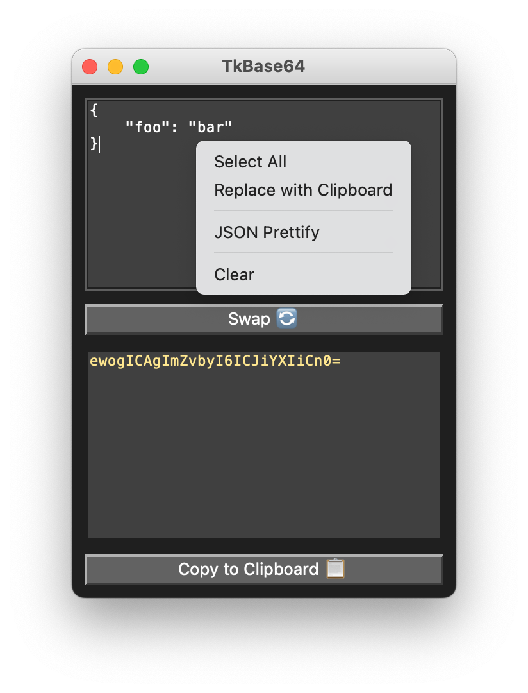

# TkBase64
Simple Tkinter GUI to encode & decode base64 strings.



- Requires Python 3.7+

### Installing:
```sh
pip install git+https://github.com/parklez/tkbase64.git
```

### Running:
In your terminal, type in:
```sh
tkbase64
```